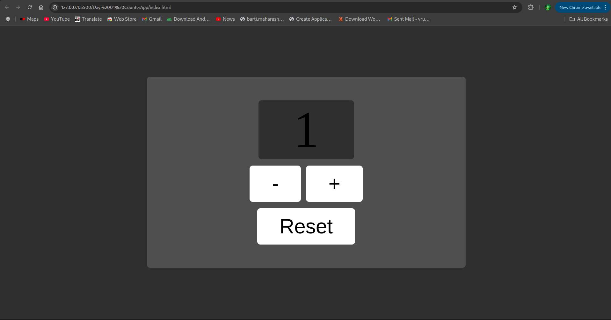

# Day 1: Counter App ✅

## 🧠 Overview

A simple counter web app that allows users to increase, decrease, and reset a number on screen.

Built using:

- HTML
- CSS
- JavaScript (Vanilla)

## 🖼️ Screenshots

