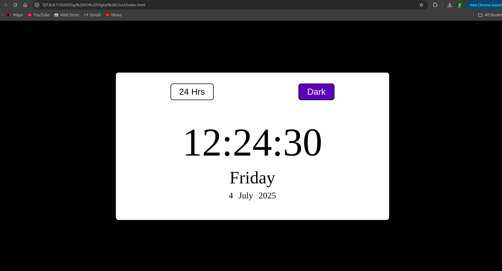
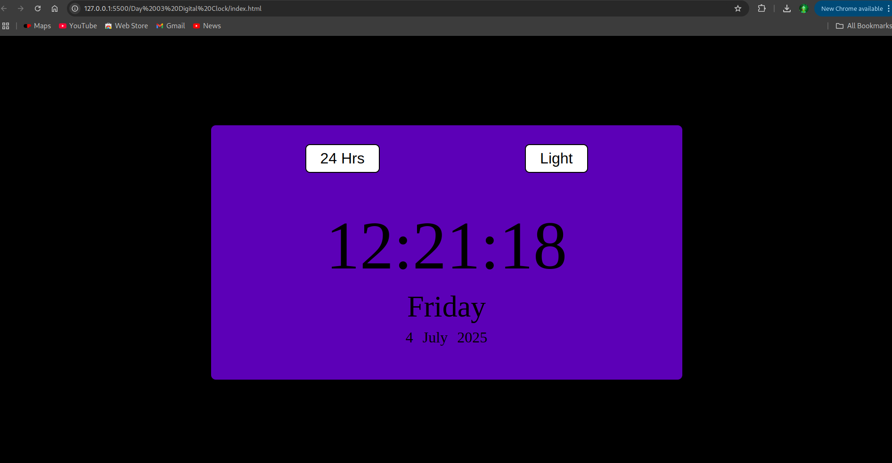

# Day 3: Digital Clock ⏰

## 📌 Overview

This project displays the current time in HH:MM:SS AM/PM format and updates every second using JavaScript's Date and setInterval. It demonstrates real-time UI updates and string formatting.

---

## 🖼️ Screenshots

### 🔹 Day Mode

### 🔹 Night Mode (Optional)

---

## ⚙️ Built With

- HTML
- CSS
- JavaScript (Vanilla)
