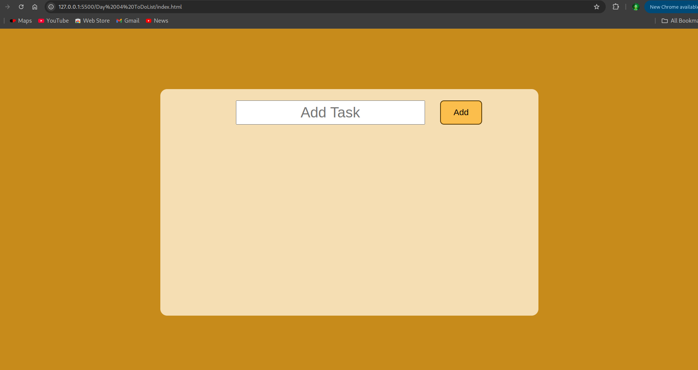
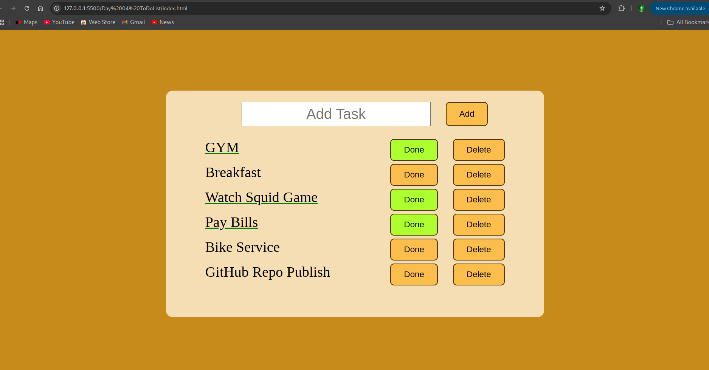

# Day 4: To-Do List 📝

## 🧠 Overview

A simple to-do app that allows users to add and remove tasks dynamically using JavaScript.

---

## 🖼️ Screenshots

### 🔹 Main Interface

### 🔹 Complete Task

---

## ⚙️ Built With

- HTML
- CSS
- JavaScript (Vanilla)
