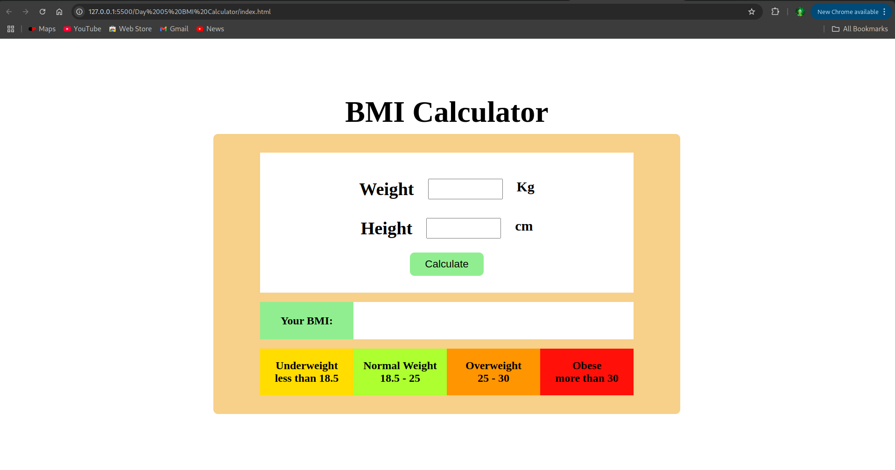
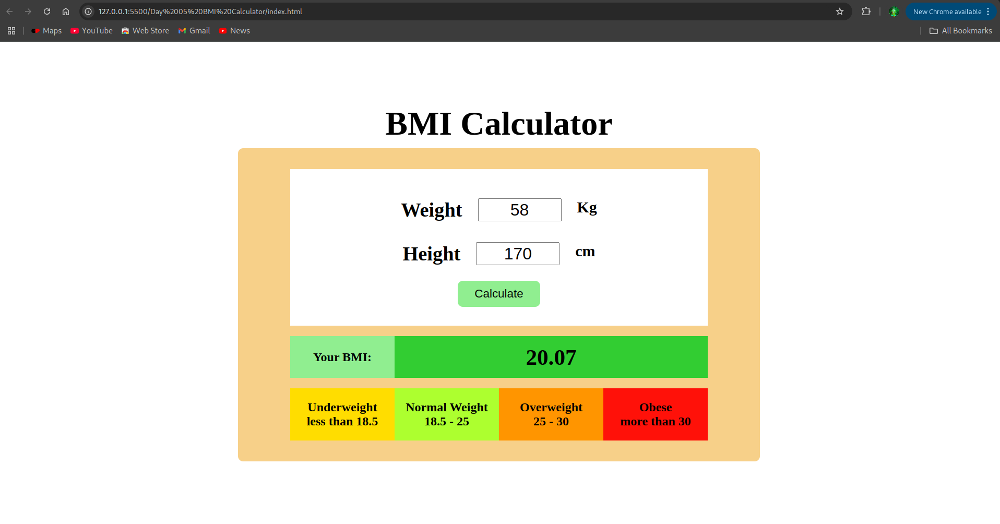

# Day 5: BMI Calculator ⚖️

## 📌 Overview

A simple BMI (Body Mass Index) Calculator that allows users to input their weight (in kg) and height (in cm) to determine their BMI value and category. This project demonstrates basic form handling, input validation, and mathematical logic with JavaScript.

---

## 🖼️ Screenshots

### 🔹 Main Interface



### 🔹 Result Display



---

## 🧮 BMI Formula

```
BMI = weight (kg) / (height (m) × height (m))
```

> Note: Height is converted from centimeters to meters before calculation.

---

## ⚙️ Built With

- HTML
- CSS
- JavaScript (Vanilla)
