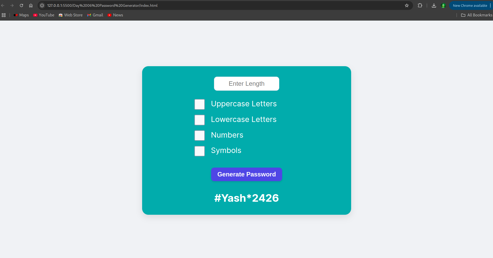
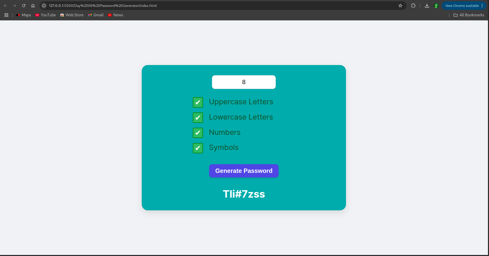

# Day 6: Password Generator 🔐

## 📌 Overview

A dynamic password generator that allows users to create secure passwords based on customizable options such as length, uppercase, lowercase, numbers, and symbols. It demonstrates string manipulation, randomization, and DOM interaction in JavaScript.

---

## 🖼️ Screenshots

### 🔹 Main Interface

### 🔹 Generated Password

---

## ⚙️ Features

- Choose password length
- Toggle uppercase, lowercase, numbers, and symbols

---

## ⚙️ Built With

- HTML
- CSS
- JavaScript (Vanilla)
