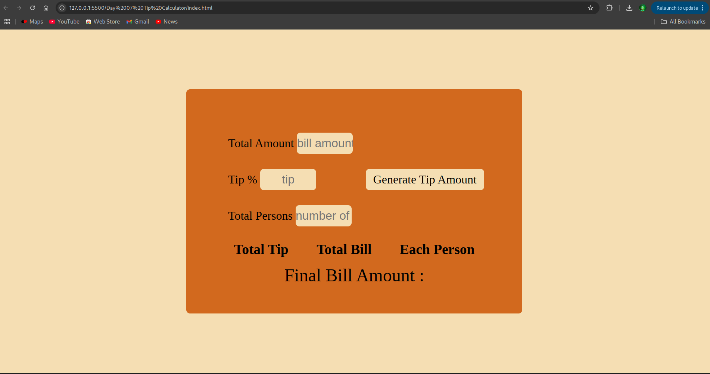
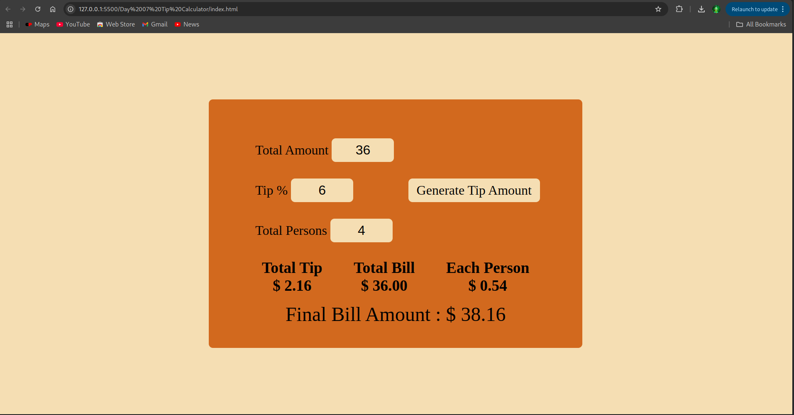

# Day 7: Tip Calculator 💰

## 📌 Overview

A simple tip calculator that lets users input the bill amount, choose a tip percentage, and optionally split the bill among multiple people. It calculates the total tip, the total bill including tip, and the amount per person.

---

## 🖼️ Screenshots

### 🔹 Main Interface

### 🔹 Calculation Result

---

## ⚙️ Features

- Input for bill amount
- Select tip percentage
- Optional split by number of people
- Displays total tip, total bill, and per-person amount

---

## ⚙️ Built With

- HTML
- CSS
- JavaScript (Vanilla)
