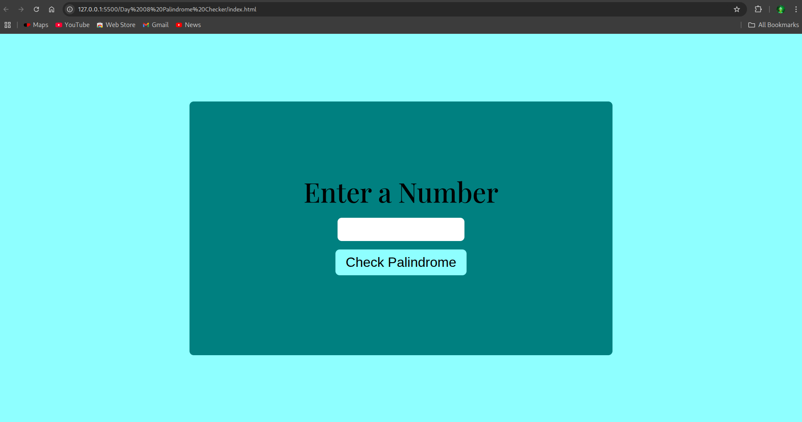
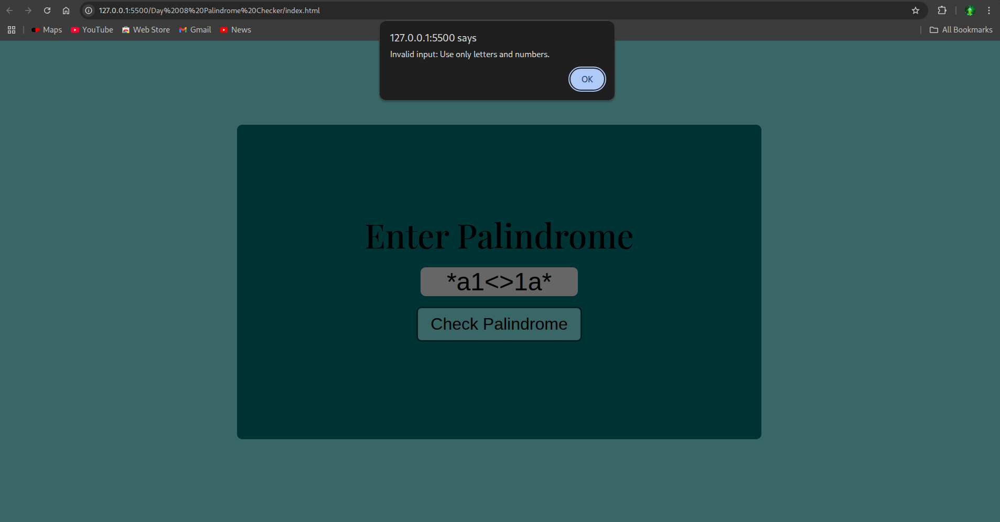
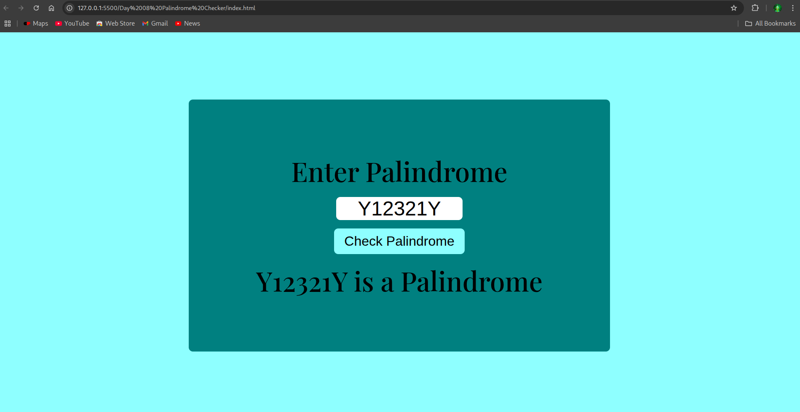

# Day 8: Palindrome Checker 🔄

## 📌 Overview

A simple Palindrome Checker that allows users to input a word or phrase and checks whether it reads the same backward and forward. Includes error handling for empty inputs and invalid (non-alphabetic) entries.

---

## 🖼️ Screenshots

### 🔹 Main Interface

### 🔹 Error Handling (Empty/NaN Input)

### 🔹 Palindrome Check Output

---

## ⚙️ Features

- Checks if a string is a palindrome
- Handles empty or invalid input gracefully
- Displays result dynamically on the page

---

## ⚙️ Built With

- HTML
- CSS
- JavaScript (Vanilla)
