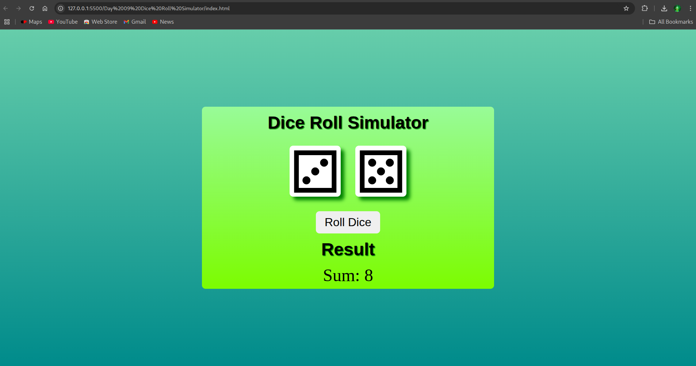

# Day 9: Dice Roll Simulator 🎲

## 📌 Overview

A simple dice roll simulator that generates a random value (1–6) each time the user clicks a button. This project demonstrates JavaScript random number generation, DOM manipulation, and dynamic image updates.

---

## 🖼️ Screenshots

### 🔹 Main Interface

### 🔹 Rolled Dice

---

## ⚙️ Features

- Roll a single dice with a random number from 1 to 6
- Update dice face image dynamically based on roll
- Roll two dice at the same time and show their total
- Interactive and responsive UI

---

## ⚙️ Built With

- HTML
- CSS
- JavaScript (Vanilla)
