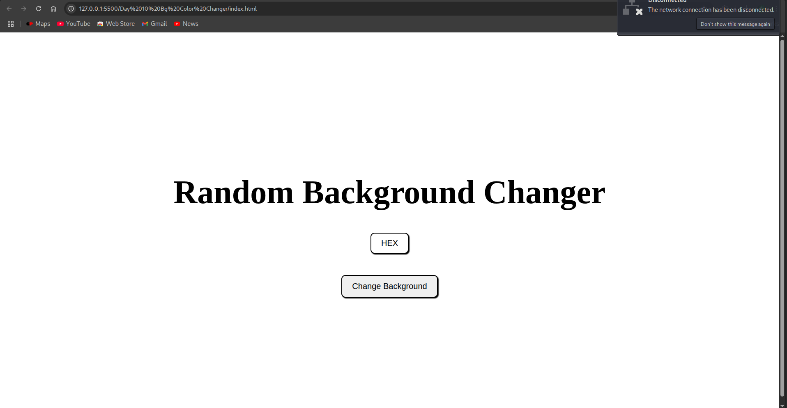
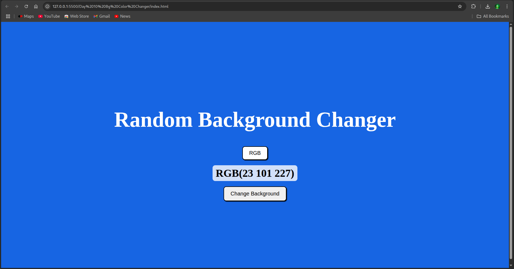

# Day 10: Color Changer 🎨

## 📌 Overview

A simple app that changes the background color of the page to a random color each time a button is clicked. It displays the color code (HEX) so users can copy and use it.

---

## 🖼️ Screenshots

### 🔹 Main Interface

### 🔹 Random Color Applied

---

## ⚙️ Features

- Changes background color to a random HEX value
- Displays the current color code dynamically
- Interactive button for generating colors

---

## ⚙️ Built With

- HTML
- CSS
- JavaScript (Vanilla)
