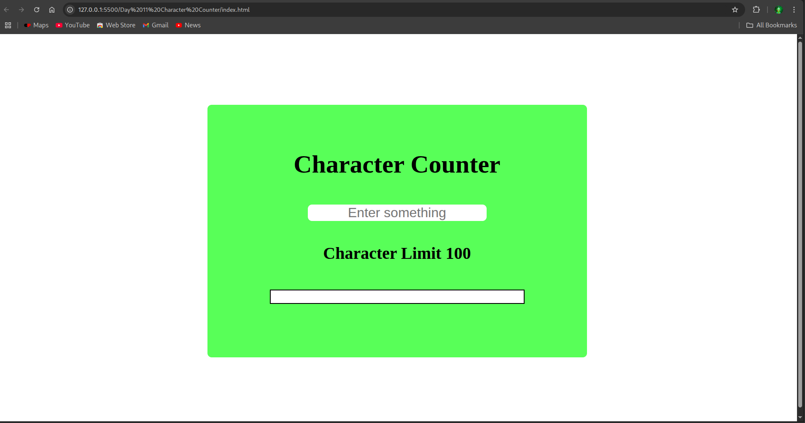
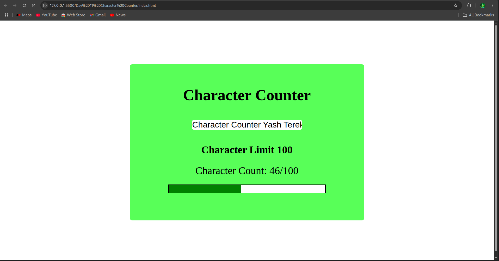
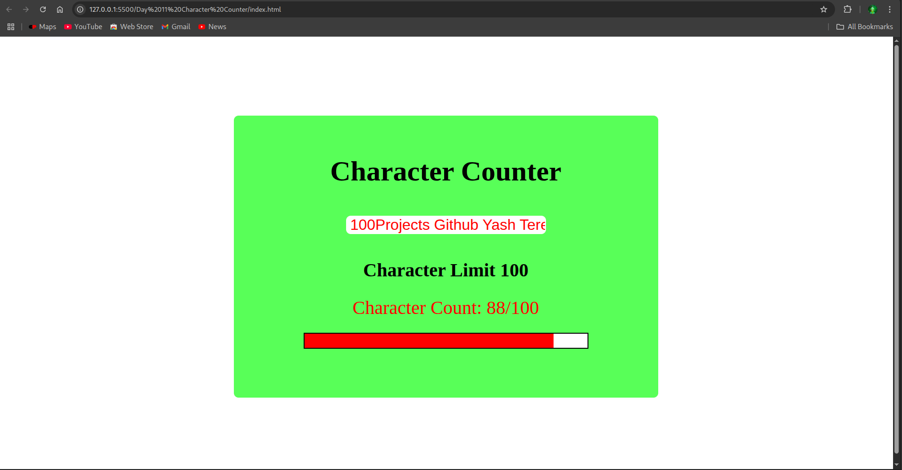

# Day 11: Character Counter 📝

## 📌 Overview

A simple app where users can type into a textarea and see a live character count, along with how many characters they have left. It helps users stay within a character limit while typing.

---

## 🖼️ Screenshots

### 🔹 Main Interface

### 🔹 Character Count in Action

### 🔹 Character Counter Limit Warning

---

## ⚙️ Features

- Live character count updates as user types
- Displays remaining characters based on limit
- Responsive UI and smooth updates
- Warning color when near limit

---

## ⚙️ Built With

- HTML
- CSS
- JavaScript (Vanilla)
