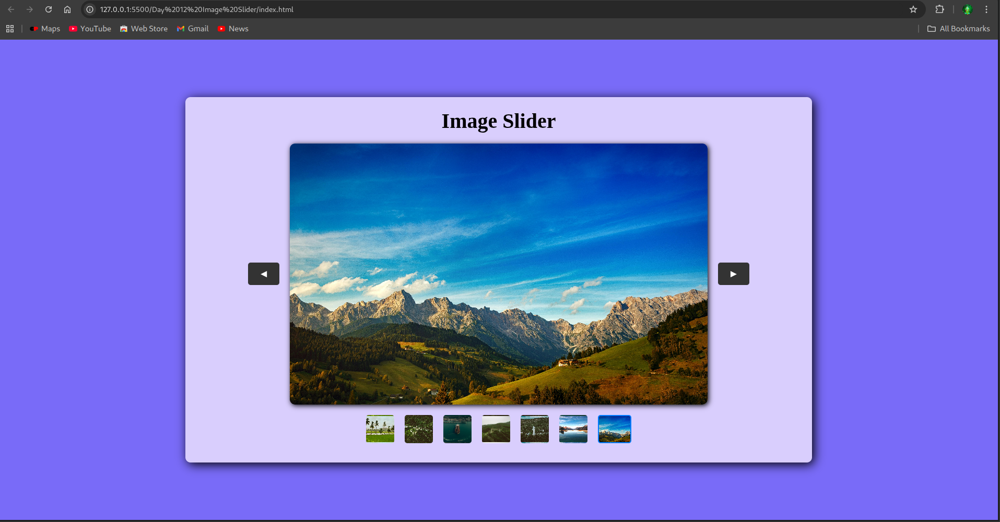

# Day 12 - Image Slider / Carousel 🎞️

This project is a simple and responsive **Image Slider / Carousel** built using HTML, CSS, and JavaScript. It allows users to navigate through multiple images using `Previous` and `Next` buttons, and optionally supports autoplay and image indicators for slide navigation.

---

## 📸 Screenshots

### ✅ Main UI

## 🔧 Features

- Next and Previous navigation buttons
- Circular sliding logic (loops back from last to first image and vice versa)
- Auto-play functionality (optional)
- Image indicators to represent current slide (optional)
- Handles edge cases and errors (e.g., image not found)

---

## ⚙️ Built With

- HTML
- CSS
- JavaScript (Vanilla)
