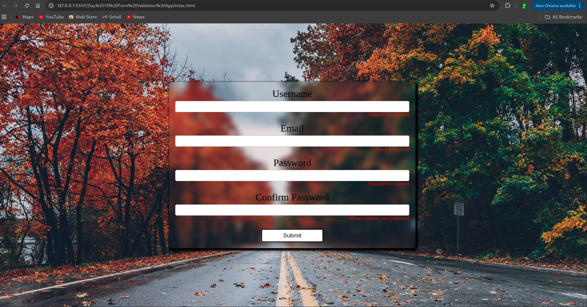
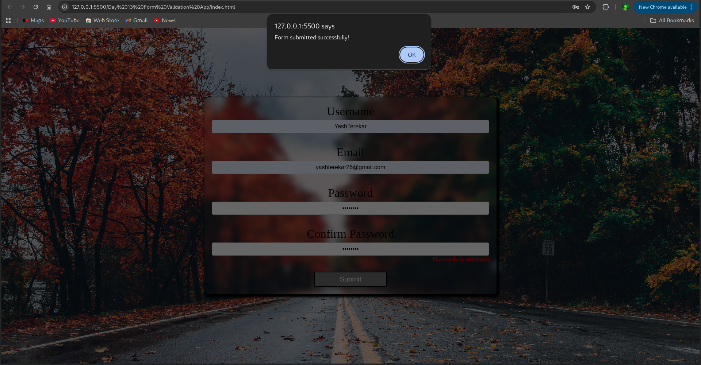

# Day 13: Form Validation App ✅

This project is a **Form Validation App** built with HTML, CSS, and JavaScript.  
It validates user input for multiple fields and provides instant visual feedback, ensuring that data entered meets specific criteria before submission.

---

## 🚀 Features

- ✅ Username validation (min length)
- 📧 Email validation using regex
- 🔐 Password & Confirm Password checks
- ❌ Inline error messages and styling
- 🟢 Success states for valid inputs

---

## 🧠 What I Learned

- Handling form submissions in JavaScript
- Preventing default form behavior
- Using regular expressions for email validation
- DOM manipulation for error/success states
- Creating reusable validation functions

---

## 📸 Screenshots

  
  

---

## 📂 Folder Structure
